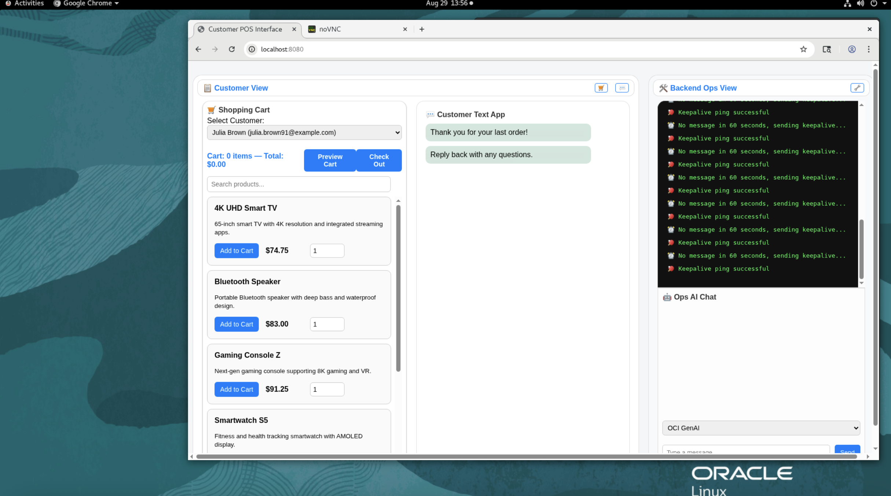
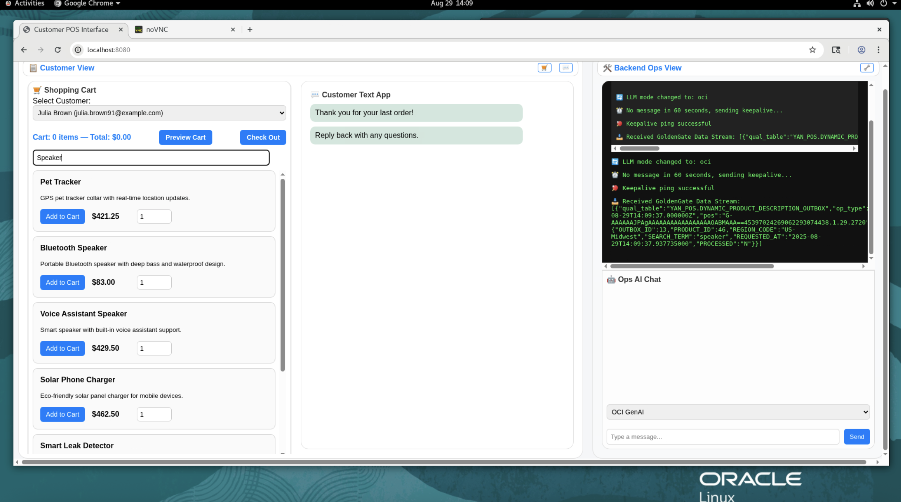
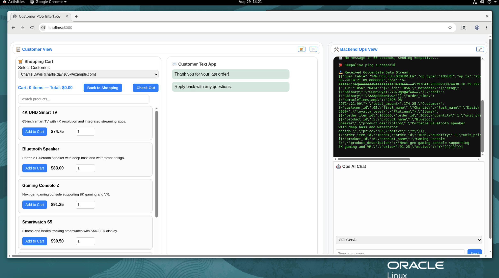
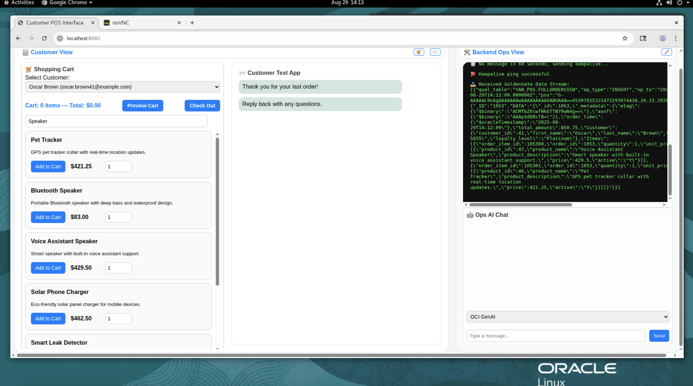
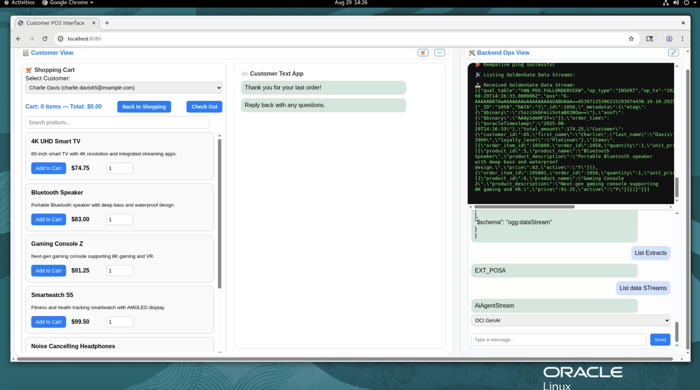
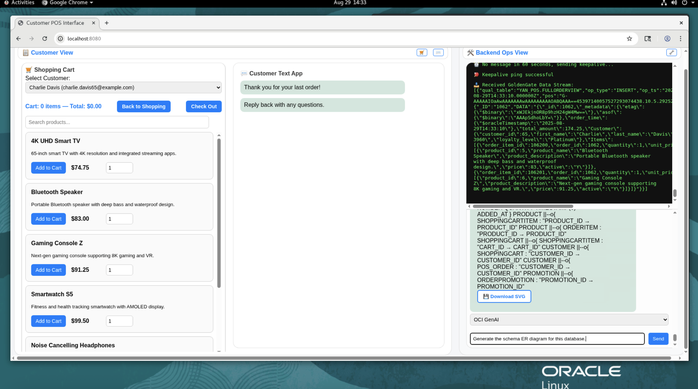

# Lab 6: Demo — End-to-End Real-Time AI Point of Sale & AI-Enabled Ops Chat

**Duration:** 20–25 minutes

## Introduction
In this lab, you will run the end-to-end demo that integrates multiple components of your AI Data Platform:
 * OCI GoldenGate ZeroETL – real-time capture of transactional POS orders.
 * JSON Duality View (JDV) in ADW – unified relational + JSON access to data.
 * AI Vector Search – semantic embeddings and similarity search for orders.
 * AI Chat Interface – natural language interaction for both business and operational queries.
 * You will observe:
     - New POS orders flowing into ADW in real time.
     - The AI Agent creating embeddings for each new order and running similarity searches.
     - AI-driven product recommendations and dynamic FOMO marketing descriptions.
     - Conversational queries that cover business insights (orders, items, revenue) and ops metrics (GoldenGate processes, streams, lag, configs, ERDs).

Objectives
By completing this lab, you will be able to:
 * Review the **AI demo app layout** and key panels.
 * Generate dynamic **AI FOMO product descriptions** and **recommendations**.
 * Validate that **JDV inserts** are captured by GoldenGate Data Streams.
 * Confirm the AI Agent creates **vector embeddings** for new orders and performs **similarity search**.
 * Use the chat interface to query **GoldenGate ops metrics** (Extracts, Replicats, lag, heartbeat, streams, configs).
 * Use the chat to query business data (orders, schema metadata, ER diagrams).

## Tasks

 1.  Review AI Demo App Layout

      -  Launch the AI Demo web application.
             URL will be provided by your instructor or in the workshop README.
      - Familiarize yourself with the key panels:
         Shopping Cart / POS System – add products, see order recommendations, view dynamic product copy.
         
         - Customer Text App – simulates customer-facing responses generated by AI.
        
          - Ops Panel – shows agentic AI activity (Data Stream events, LLM prompts, responses).
         
         - Ops Chat – query operational data using natural language. 
          

2. Generate Dynamic AI-Driven FOMO Descriptions

     Goal: 
      - Observe AI creating compelling, urgency-driven product descriptions (e.g., “Only 3 left!”, “Trending now!”, “Bestseller this week!”).
      - Understand how product searches trigger outbox events, LLM requests, and live description updates in the Shopping Cart / POS System.
      - Experience multiple dynamic rewrites generated in real time. 
          - Search for a Product
          - In the Shopping Cart / POS System, search for any product (e.g.,“Speakers”).  
          - Monitor Outbox Events in the Ops Panel
          - Switch to the Ops Panel.
          - Locate the data stream for:
              YAN\_POS.DYNAMIC\_PRODUCT\_DESCRIPTION\_OUTBOX
          - Confirm that a new message event appears.
          
     - Observe the LLM Request
          - Inspect the event details in the outbox.
          - Verify that the original product description is sent to the LLM with a request to rewrite the copy with FOMO language.
     - View the Updated Description
         - Return to the Shopping Cart / POS System.
         - Confirm that the product now displays an AI-generated FOMO description.
         - Examples you may see:
             - “Only 3 left—hurry!”
             - “🔥 Trending now—don’t miss out!”
             - “Bestseller this week!”
     - Repeat the Process
         - Perform the same product search multiple times.
         - Each time, observe:
             - A new outbox event in YAN\_POS.DYNAMIC\_PRODUCT\_DESCRIPTION\_OUTBOX.
             - A new request sent to the LLM.
             - A different rewritten description displayed in the Shopping Cart.
      
      See AI created compelling product descriptions that drive urgency.(“Only 3 left!”, “Trending now!”).
      - In the Shopping Cart / POS System, search for a product.
      - In the Ops Panel, observe a new message flowing into:
         - YAN_POS.DYNAMIC\_PRODUCT\_DESCRIPTION\_OUTBOX.
         - Request sent to the LLM for rewriting product copy.
         - The updated FOMO-style description appears live in the Shopping Cart.
         - Examples: “Only 3 left!”, “Trending now!”, “Bestseller this week!”
     - Repeat the search multiple times to observe: Multiple outbox events.

3.  AI Agent: Vector Embedding per New Order
      
      Scenario 1: With Cart Preview

      Goal:Verify that the AI Agent generates a vector embedding row for each new order.
     
      - Select a customer.
      - Add items to the cart.
      - Preview the cart.
      - Check out.
      - In the Ops Panel, confirm:
             - Data stream entry created in YAN\_POS.FULLORDERVIEW.
             - Cart summary generated.
             - Vector embedding created and sample displayed.
             - Similarity search performed against all past carts.
             - Three similar carts returned.
             - First non-matching product identified.
             - Prompt generated for the LLM to create a recommendation.
             - LLM response returned to the Customer Text App.
             

     
      Scenario 2: Without Cart Preview
     
      Goal: Validate that the workflow runs identically even if the cart is not previewed.

      - Select a customer.
      - Add items to the cart.
      - Do NOT preview the cart.
      - Check out.
      - In the Ops Panel, confirm the same sequence of events as Scenario 1:
         - Data stream entry created in YAN\_POS.FULLORDERVIEW.
         - Cart summary generated.
         - Vector embedding created and sample displayed.
         - Similarity search performed against all past carts.
         - Three similar carts returned.
         - First non-matching product identified.
         - Prompt generated for the LLM to create a recommendation.
         - LLM response returned to the Customer Text App.
         

4.  GoldenGate Operations via Chat
      Use chat to retrieve real-time GoldenGate statistics.
     - List Extracts
     - List GoldenGate extracts. For each, include name, status, checkpoint SCN/CSN, and current lag.
     - Show goldengate statistics. ----- (RAG add stats to prompt)
     - Show overall GoldenGate statistics and list all data streams with status, last delivered time, and record counts.
     - List data streams
     - Get te data streams
     - Get data stream config AiAgentStream
     - Get the configuration for the data stream named "AiAgentStream". Summarize source trail, target connection, filters, and error policy.
     - Get data stream yaml AiAgentStream
     - Get the YAML for the data stream named "AiAgentStream".
     

5. Data Operations via Chat
     - Use chat to explore the schema and query order data.
     - Try prompts like:
         - "Show me the details for Order 483." (RAG similarity search).
         - "Generate the schema ER diagram for this database."
         - "Is there a table with orders?" (RAG add schema metadata to prompt)
         - "Show me the schema for POS_ORDER / ORDERITEM / FULLORDERVIEW."
         - "Does a data product exist for FULLORDERVIEW?"
     

## Acknowledgements
* **Author** - Shrinidhi Kulkarni, GoldenGate Product Manager
* **Reviewed By**  - Denis Gray,  Vice President, GoldenGate Product Management
* **Last Updated By/Date** - Jenny Chan, September 2025