# Connect and prepare databases
## Introduction

This lab guides you step by step through launching the Oracle GoldenGate 23ai Microservices WebUI, creating connections to the source (West) and target (East) databases, enable supplemental logging (Trandata) to the source database, create a Checkpoint table to the target database, and configuring Heartbeat tables on both databases.

Estimated time: 20 minutes

   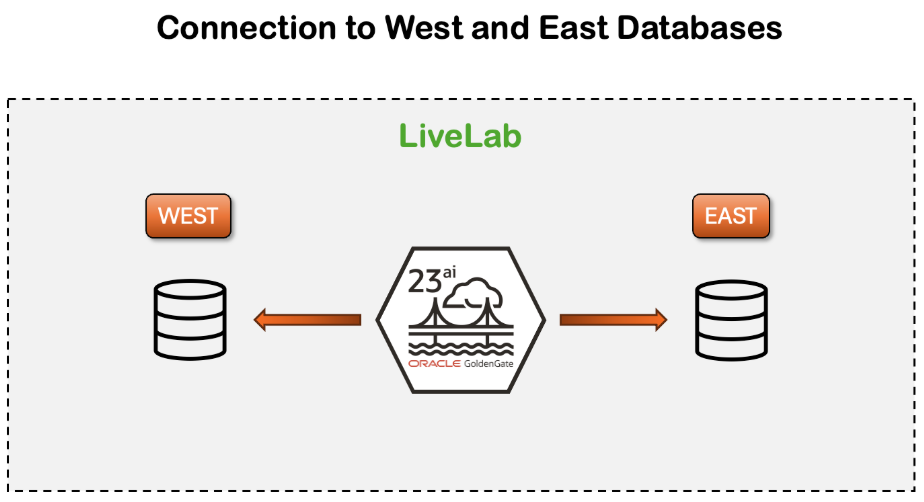

### Objectives

In this lab, you:
* Log in to the Oracle GoldenGate 23ai Microservices WebUI
* Create a Connection to the East and West databases
* Add Trandata and the heartbeat tables to the West database
* Add a checkpoint table and the heartbeat tables to the East database

### Before you begin

Ensure that you can access the **password_file.txt** that contains the credentials you'll use throughout the workshop.

1. In your VNC environment, click **Activities**.

    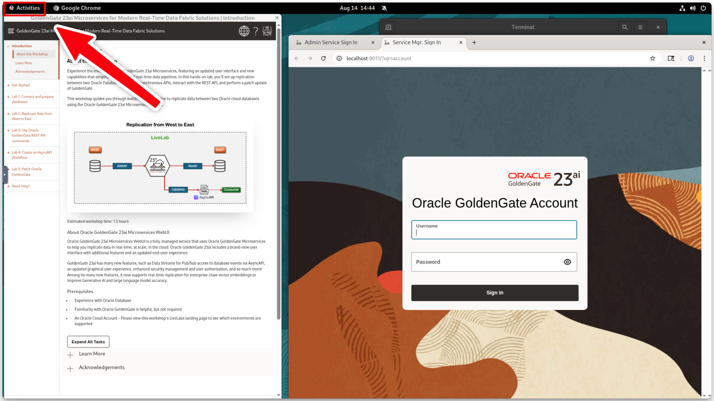

2. In the Applications bar, select the **Text editor**.

    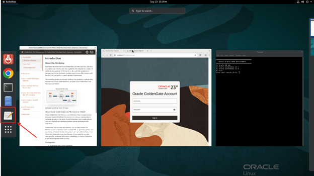

3. In the text editor, click **Open**, and then select **password_file.txt**.

    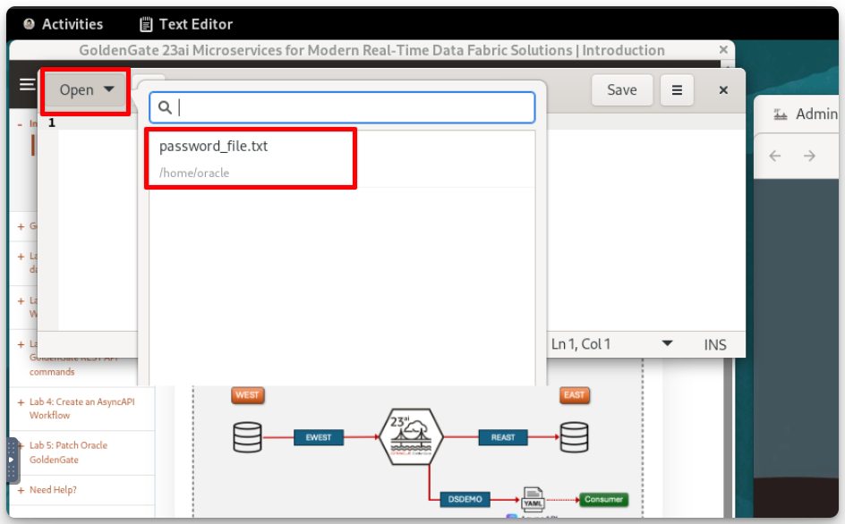

## Task 1: Add DB Connection to East database

### About DB Connections

DB Connections let you to create and manage the login credentials needed to connect to your databases and manage Checkpoint tables, supplemental logging (TRANDATA), and Heartbeat tables.

1. In your VNC environment, select the **Admin Service Sign In** tab. Enter **oggadmin** for Username, enter the Password copied from **password_file.txt**, and click **Sign In**.

    > **Note**: If prompted by your browser to save the username and password, decline the offer. Storing these credentials may lead to incorrect autofill entries in later lab steps. 

    

2. After you log in, select **DB Connections** from the navigation menu.

    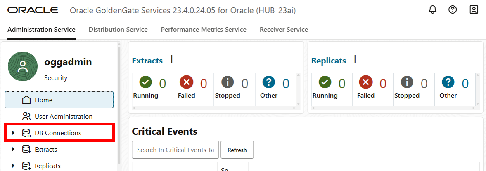

3. Click **Add DB Connection** (plus icon).

    

4. In the Credentials panel, complete the following fields, and then click **Submit**:
    * For Credential Alias, enter **EAST**.
    * For User ID, enter **ggadmin@localhost:1521/East**. 
    * For Password, enter the Password copied from **password_file.txt**. Verify the password. 

    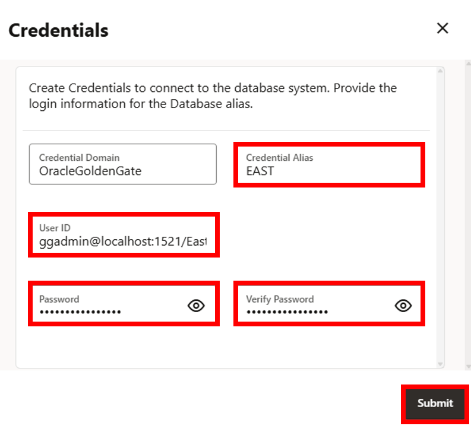

5. Click **Connect to database**. If successful, the Checkpoint page opens. 

    

## Task 2: Add a Checkpoint table and Heartbeat table

### About Checkpoint table and Trandata

Create a Checkpoint table in the target database to provide fault tolerance for the Replicat process. Trandata enables the unconditional logging of primary keys and the conditional supplemental logging of all unique and foreign keys for the specified table. Adding Trandata is required for the source database.

1. In the navigation menu, under the EAST connection, select **Checkpoint**. On the Checkpoint page, click **Add Checkpoint** (plus icon).

    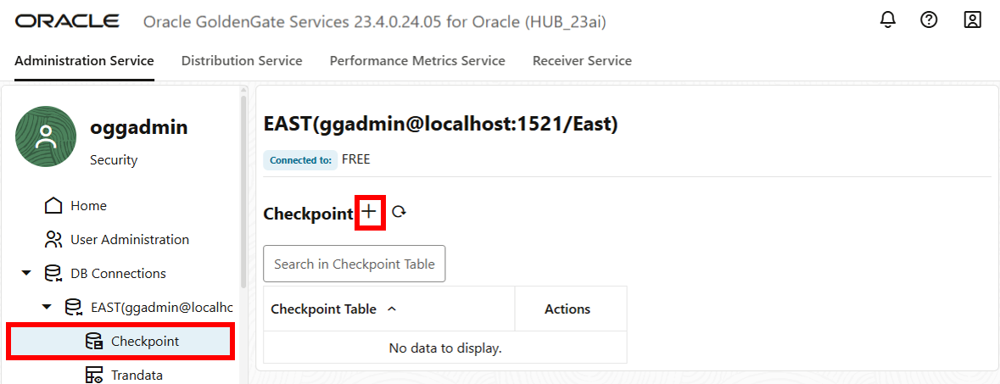

2. In the Checkpoint Table panel, for Checkpoint Table, enter **ggadmin.checkpointtable**, and then click **Submit**.

    

3. The new Checkpoint table appears in the Checkpoint Table list.

    

4. In the navigation menu, select **Heartbeat**. On the Heartbeat page, click **Add Heartbeat** (plus icon).

    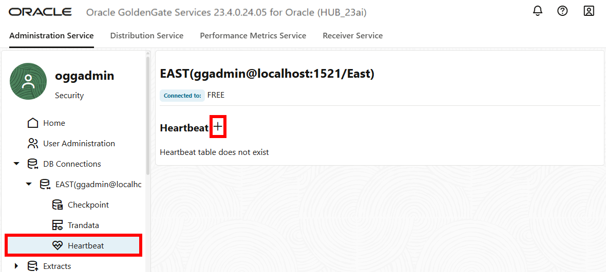

5. In the Add Heartbeat Table panel, enable the **Target Only** for the EAST database connection, and then click **Submit**.

    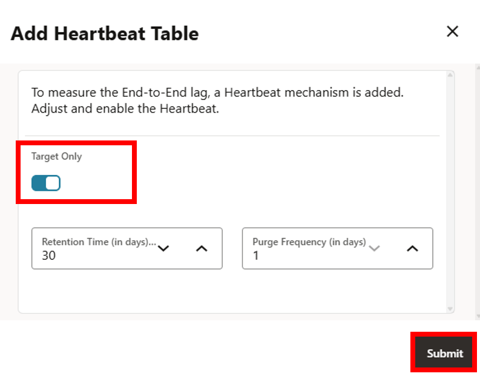

6. The Heartbeat page refreshes with the new settings.

    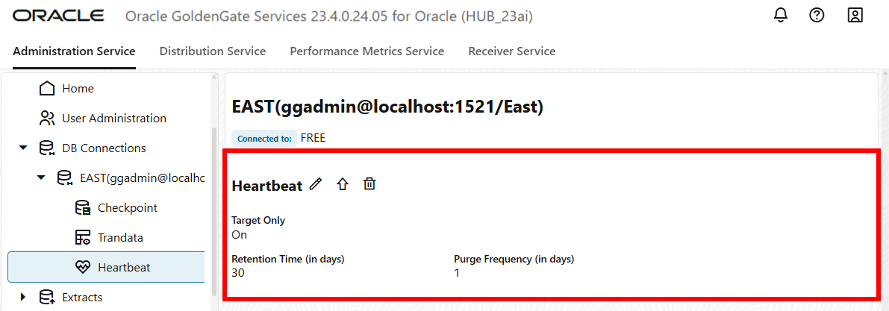

## Task 3: Add DB connection to West database

1. In the navigation menu, click **DB Connections**. On the DB Connections page, click **Add DB Connection** (plus icon) to add the West database connection.

    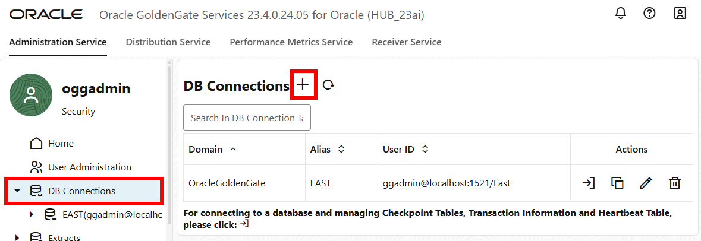

2. In the Credentials panel, complete the following fields, and then click **Submit**:
    * For Credential Alias, enter **WEST**.
    * For User ID, enter **ggadmin@localhost:1521/West**. 
    * For Password, enter the Password copied from **password_file.txt**. Verify the password.

    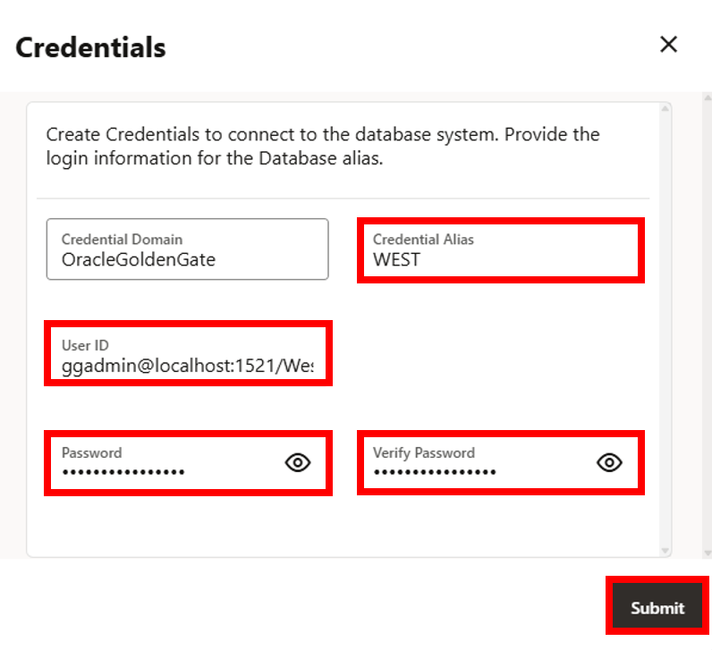

3. On the DB Connections page, for the WEST connection, click **Connect to database**. If successful, the Checkpoint page loads.

    

## Task 4: Add Trandata information and a Heartbeat table

The West database serves as the source database and no Checkpoint table is required. However, Trandata is required and you will create the Heartbeat tables.

1. In the navigation menu, under the WEST connection, click **Trandata**. On the TRANDATA Information page, click **Add TRANDATA** (plus icon).

    

2. In the Trandata panel, for Schema Name, enter **HR**, and then click **Submit**.

    

3. To verify, on the TRANDATA Information page, enter **HR** into the Search field, and click **Search**. The HR schema appears in the search results.

    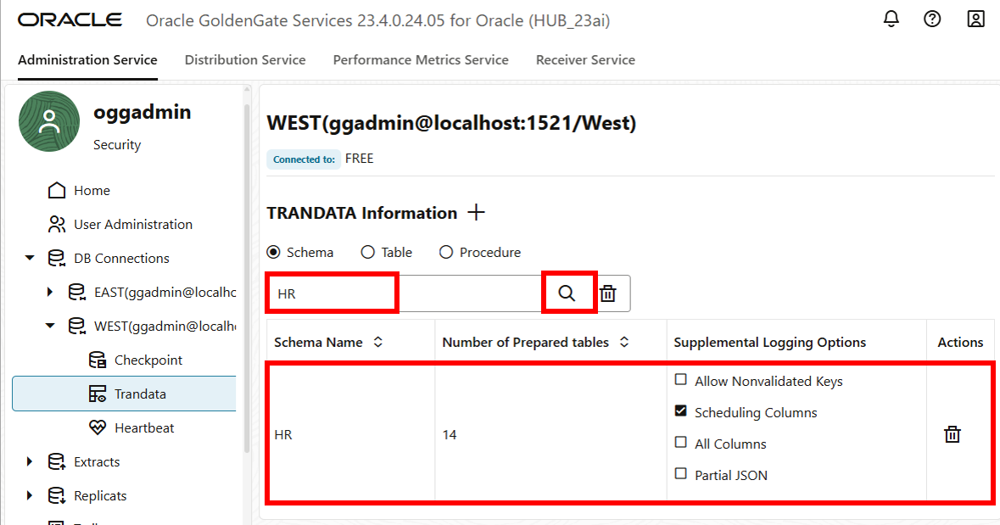

4. In the navigation menu, under the WEST connection, click **Heartbeat**. On the Heartbeat page, click **Add Heartbeat** (plus icon).

    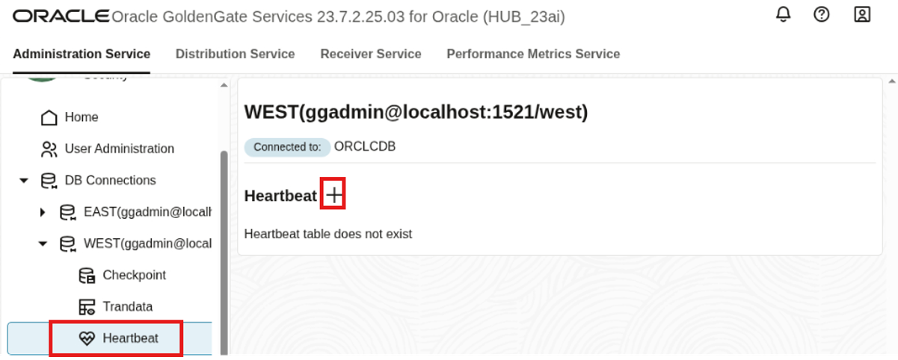

5. In the Add Heartbeat Table panel, leave the default settings, and then click **Submit**.

    

    The Heartbeat page refreshes with the new settings.

    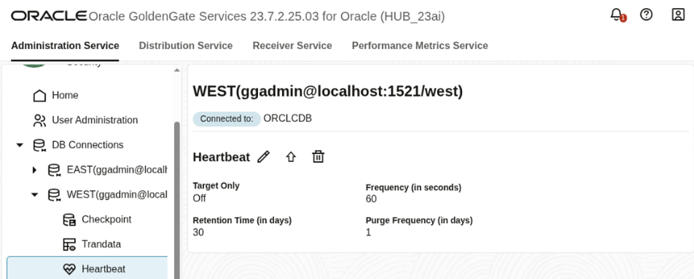

You may now **proceed to the next lab.**

## Learn more

* [Add Database Connections](https://docs.oracle.com/en/middleware/goldengate/core/23/coredoc/extract-add-and-alter-database-connections.html#GUID-45112AEE-19[…]3AE-18571BFA831B)
* [Add TRANDATA](https://docs.oracle.com/en/middleware/goldengate/core/23/coredoc/configure-ogg-adding-extract-and-replicat.html#GUID-5848749D-282E-4DA9-9D65-00C34ED5F3BF)
* [Add a Checkpoint Table](https://docs.oracle.com/en/middleware/goldengate/core/23/coredoc/configure-ogg-adding-extract-and-replicat.html#GUID-5640BC36-4AC0-4570-A7DA-DC7BBFBDC1EB)
* [Add Heartbeat Table](https://docs.oracle.com/en/middleware/goldengate/core/23/coredoc/configure-ogg-adding-extract-and-replicat.html#GUID-45112AEE-1909-42F4-A3AE-18571BFA831B)

## Acknowledgements
* **Author** - Katherine Wardhana, User Assistance Developer
* **Contributors** - Mack Bell, Senior Principal Product Manager & Alex Lima, Database Product Management
* **Last Updated By/Date** - Katherine Wardhana, August 2025